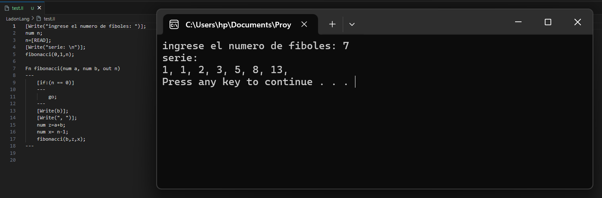
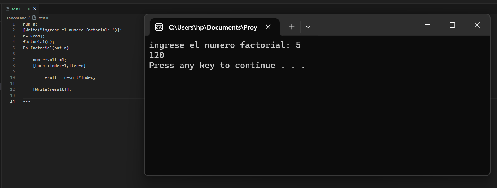

# LadonLang

LadonLang es un lenguaje de propósito general básico que es Turing completo y se basa en las data annotations de C# en el uso de sus instrucciones a base de etiquetados (como [LOOP], [IF],...), pero sin cierres sino con bloques de código como la mayoría de lenguajes actuales.

## Instalación:

### Dependencias:

#### Para interesados en contribuir:

**NET SDK:** Necesario para la compilación y desarrollo del proyecto.

**Microsoft redistributable C++:** En algunos casos necesario en los editores de código.

#### Para programar en LadonLang:

1. Instalar MinGW-w64 o MSYS2 para tener un compilador C++ disponible en su sistema.
   1. MSYS2 Descargar e instalar MSYS2:
      - Desde [MSYS2](https://www.msys2.org/)
   2. Actualizar e instalar MinGW dentro de MSYS2:
      - Abre la terminal de MSYS2 y ejecuta:

      ```
      pacman -Syu
      pacman -Su
      pacman -S mingw-w64-x86_64-toolchain
      ```
   3. Agrega la ruta de MinGW (C:\msys64\mingw64\bin) a las variables de entorno del sistema.

### Desde un terminal:

1. Para usar **LadonLang** desde cualquier lugar en tu sistema, sigue estos pasos:

   1. Compila el proyecto y coloca `ladonlang.exe` en una carpeta
      específica, por ejemplo `C:\path\to\ladonlang`.
   2. Agrega la ruta de la carpeta a las Variables de Entorno del sistema:
      - Abre la **Configuración avanzada del sistema**.
      - Haz clic en **Variables de entorno...**.
      - En **Variables del sistema**, selecciona `Path` y haz clic en **Editar...**.
      - Agrega la ruta `C:\path\to\ladonlang` y guarda los cambios.

   ¡Listo! Ahora puedes usar **LadonLang** desde cualquier lugar en tu sistema.

## Uso del lenguaje:

Contiene una serie de instrucciones propias de un lenguaje de programación:
**Sintaxis de declaraciones:**

* num: es un tipo de dato que representa un entero.
* str: es un tipo de dato que representa una cadena.

```
Num identifier1;

Num identifier2=Identifier1+1;

Str identifier3;

Str identifier4="cadena de texto";
```

**Sintaxis de entrada de datos:**

* [Read] representar una entrada de datos de consola dado a una variable.
* ("entrada") la entrada de los datos.
* Url: Si se desea escribir directamente en un documento se indica el path de entrada.

```
Identifier=[Read];

[Read("entrada"):Url="docUrl"];
```

**Sintaxis de salida de datos:**

* [Write] representa una entrada de datos de consola dado a una variable.
* ("entrada") la entrada de los datos.
* Url: Si se desea escribir directamente en un documento se indica el path de entrada.

```
[Write("message")];

[Write : Url="docUrl"];
```

**Sintaxis de control de flujo:**

* Go Interrumpe el flujo de una estructura de control.
* Go #name Interrumpe el flujo de una estructura de control y/o desde cierto punto de código redirige a la estructura que referencie el identificador.

```
Go;

Go #name;
```

**Sintaxis de sentencia iterativa:**

* name: si se encuentra en el contexto global puede darsele un nombre a la estructura y usarla despues sin redefinirla.
* Iter: representa el maximo de iteraciones maximas del ciclo.
* Index: representa el valor desde que inicia el ciclo.

```
[Loop]
---
	bloque_de_instrucciones;
---
```

```[Loop
---
    num result = Index;
    result += Iter;
    ...
	bloque_de_instrucciones;
---
```

```
[Loop #name]
---
	bloque_de_instrucciones;
---
```

```[Loop
---
	bloque_de_instrucciones;
---
```

**Sintaxis de sentencia condiconal:**

* condicion: una serie de instrucciones condicionales a cumplir para entrar en el bloque de código
* #: si se encuentra en el contexto global puede darle un nombre a la estructura y usarla después sin redefinirla.

```
[If:(condicion)]
---
    bloque_de_instrucciones;
---
```

```
[If:(condicion) #name]
---
    bloque_de_instrucciones;
---
```

**Sintaxis de funciones:**

* La palabra reservada FN, definde que es una funcion.
* Se le da un nombre a la función.
* Entre paréntesis se pasan los parámetros con su tipo de dato.
* La palabra reservada out, define el retorno de valor que tendrá la función pasando por referencia la variable y cambiando su valor dentro de la función.

```
FN name(type paremeter1,…, type paremeterN)
---
    bloque_de_instrucciones;
---
```

```
FN name(type paremeter1,…, type paremeterN, Out outIdentifier)
---
    bloque_de_instrucciones;
---
```

```
FN name(type paremeter1,…, type paremeterN)
---
    bloque_de_instrucciones;
---
```

```
FN name(type paremeter1,…, type paremeterN, Out outIdentifier)
---
    bloque_de_instrucciones;
---
```

### Ejemplos de uso:

* Serie Fibonacci:



```
[Write("ingrese el numero de fiboles: ")];
num n;
n=[READ];
[Write("serie: \n")];
fibonacci(0,1,n);

Fn fibonacci(num a, num b, out n) 
---
    [if:(n == 0)]
    ---
        go;
    ---
    [Write(b)];
    [Write(", ")];
    num z=a+b;
    num x= n-1;
    fibonacci(b,z,x);
---
```

* factorial:
  

```
num n;
[Write("ingrese el numero factorial: ")];
n=[Read];
factorial(n);
Fn factorial(out n)
---
    num result =1;
    [Loop :Index=1,Iter=n]
    ---
        result = result*Index;
    ---
    [Write(result)];

---
```

## Compilación:

* **En desarrollo:**
  ``dotnet run -Compile fileName.ll``

``dotnet run -Compile -Path "origin_path/.../fileName.ll" ``

* **Desarrollando en ladonLang:**
  * **Nota:** se requiere de tenerlo en las variables de entorno.
    ``LadonLang.exe -Compile fileName.ll``

``LadonLang.Exe -Compile -Path "origin_path/.../fileName.ll" ``

## Mejoras futuras:

* **Importante conocer:** El lenguaje fue creado en el tiempo libre que disponía con el objetivo de aprender y practicar, por lo tanto puede estar sujeto a fallos de los cuales no soy consciente y la implementación es mejorable.
* Refactorización total del código.
* Implementación de una clase propia para el manejo de errores.
* Permitir expresiones más complejas en el uso de variables, declaración de variables, parámetros en las llamadas de función.
* Cambiar la generación de código de un código a bajo nivel directamente, a un código de tres direcciones ya que parece ser un estándar en el desarrollo de lenguajes de programación.
* Implementación de los tipos Any (representa un vector de cualquier tipo), Long (número decimal o entero de cualquier longitud), Default (tipo que infiere cualquier tipo de dato y en primera instancia lo toma como string).
* Implementación de la sentencia [Entity] el cual representará una estructura que permite tener variables y funciones dentro pero manejadas desde el stack para ser lo más rápidas posibles.

## Creditos correspondientes:

**El lenguaje fue desarrollado enteramente a la fecha por el creador del repositorio, sin embargo se escribió en C#, se usó código intermedio en C++ y se instalaron las dependencias siguiendo las guías de instalación de [MSYS2](https://www.msys2.org/) y consultas de la sintaxis del lenguaje en [Microsoft](https://learn.microsoft.com/en-us/)**
