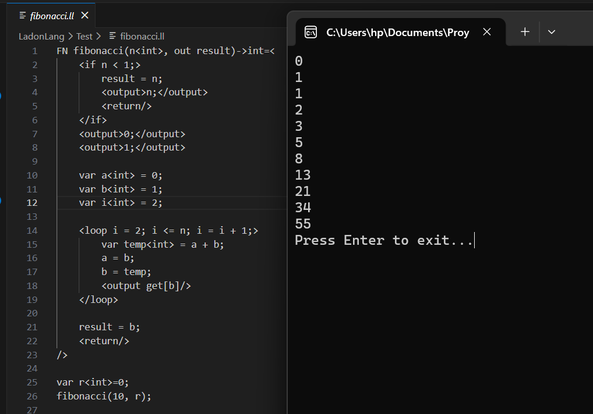

# LadonLang

LadonLang es un lenguaje de propósito general básico que es Turing completo asemejando su sintaxis a etiquetas de html oneniendo cada bloque de codigo dentro de las mismas (como <loop>...</loop>, <select>...</select>, ....,), ofreciendo un enfoque amigable como propuesta de lengauje de programación.

## Instalación:

### Dependencias:

#### Para interesados en contribuir:

**NET SDK:** Necesario para la compilación y desarrollo del proyecto.

**Microsoft redistributable C++:** En algunos casos necesario en los editores de código.

#### Para programar en LadonLang:

1. Instalar MinGW-w64 o MSYS2 para tener un compilador C++ disponible en su sistema.

   1. MSYS2 Descargar e instalar MSYS2:
      - Desde [MSYS2](https://www.msys2.org/)
   2. Actualizar e instalar MinGW dentro de MSYS2:

      - Abre la terminal de MSYS2 y ejecuta:

      ```
      pacman -Syu
      pacman -Su
      pacman -S mingw-w64-x86_64-toolchain
      ```

   3. Agrega la ruta de MinGW (C:\msys64\mingw64\bin) a las variables de entorno del sistema.

### Desde un terminal:

1. Para usar **LadonLang** desde cualquier lugar en tu sistema, sigue estos pasos:

   1. Compila el proyecto y coloca `ladonlang.exe` en una carpeta
      específica, por ejemplo `C:\path\to\ladonlang`.
   2. Agrega la ruta de la carpeta a las Variables de Entorno del sistema:
      - Abre la **Configuración avanzada del sistema**.
      - Haz clic en **Variables de entorno...**.
      - En **Variables del sistema**, selecciona `Path` y haz clic en **Editar...**.
      - Agrega la ruta `C:\path\to\ladonlang` y guarda los cambios.

   ¡Listo! Ahora puedes usar **LadonLang** desde cualquier lugar en tu sistema.

## Uso del lenguaje:

Contiene una serie de instrucciones propias de un lenguaje de programación:
**Sintaxis de declaraciones:**

- int: es un tipo de dato que representa un entero.
- float: es u tip de dato que representa un valor con decimales
- string: es un tipo de dato que representa una cadena.
- char: representa un unico caracter.
- var: es la palabra resrvada que permite decir que es una delaración

```
var intValue<int> = 0;
var floatValue<float> = 0;
var stringValue<string> = "";
var charValue<char> = 'a';

```

**Sintaxis de entrada de datos:**

- `<input/>` representar una entrada de datos de consola dado a una variable.
- `type=[key]` represnta la entrada de un solo caracter.
- `key='A'` en conjunto con type representan el tipo de caracter que se espera como entrada.
- `set` permite asignar directamente la entrada a una variable;

```
var variableName<string> = "";
<input/>
<input type=[key]/>
<input type=[key] key='A'/>
<input key='A' type=[key]/>
<input set[variableName]/>

```

**Sintaxis de salida de datos:**

- `<output>...</output>` o `</output>` representa una salida de datos en consola.
- `get` permite mostrar directamente el valor de una variable como salida.

```
var variableName<string> = "";
<output> variableName;</output>
<output get[variableName]/>

```

**Sintaxis de sentencia iterativa:**

- `pass`: permite ignorar la primer instrucion del ciclo.

```
<loop 1 > 2;>
    bloque_de_instrucciones;
</loop>
```

```
<loop true; pass>
    bloque_de_instrucciones;
</loop>
```

```
<loop i = 0; i < 10; i = i + 1;>
    bloque_de_instrucciones;
</loop>

```

**Sintaxis de sentencia condiconal:**

- condicion: una serie de instrucciones condicionales a cumplir para entrar en el bloque de código

```
<if condicion;>
    bloque_de_instrucciones;
</if>
```

```
<if condicion;>
    bloque_de_instrucciones;
</if>
<else>
    bloque_de_instrucciones;
</else>
```

```
<if condicion;>
    bloque_de_instrucciones;
</if>
<elif condicion;>
    bloque_de_instrucciones;
</elif>
    bloque_de_instrucciones;
<else>
    bloque_de_instrucciones;
</else>

```

**Sintaxis de sentencia selectiva:**

- caseValue: es el nombre de la variable que se evalua en cada caso.
- value: es la palabra reservada usada para indicar que valor tiene esa opción.
- default: nos indica la opción por defecto en caso de no encontrar coincidencias.

```
<select caseValue>
    <option value=1>
    </option>
    <option value=2>
    </option>
</select>
```

```
<select numero>
    <option value=1>
    </option>
    <option default>
    </option>
</select>
```

**Sintaxis de funciones:**

- La palabra reservada FN, definde que es una funcion.
- Se le da un nombre a la función.
- Entre paréntesis se pasan los parámetros con su tipo de dato.
- La palabra reservada out, define el retorno de valor que tendrá la función pasando por referencia la variable y cambiando su valor dentro de la función.

```
FN functionName(parameter1<int>, parameter2<int>)=<
var s<int> = 1;
<return/>
/>
```

```
FN nombre3(out par1)->int=<
var n<int> =1;
/>
```

```
FN nombre4(parameter1<int>, out parameter2<int>)=<
/>
```

### Ejemplos de uso:

#### Serie Fibonacci:



```
FN fibonacci(n<int>, out result)->int=<
<if n < 1;>
result = n;
<output>n;</output>
<return/>
</if>
<output>0;</output>
<output>1;</output>

    var a<int> = 0;
    var b<int> = 1;
    var i<int> = 2;

    <loop i = 2; i <= n; i = i + 1;>
        var temp<int> = a + b;
        a = b;
        b = temp;
        <output get[b]/>
    </loop>

    result = b;
    <return/>

/>

var r<int>=0;
fibonacci(10, r);
```

#### factorial:


```
FN factorial(n<int>, out result<int>)=<
    <if n < 0;>
        result = 0;
        <return/>
    </if>

    result = 1;

    <loop i = 1; i <= n; i = i + 1;>
        result = result * i;
        <output>result; </output>
    </loop>

    <return/>
/>

var num<int>;
factorial(5,num);
```

## Compilación:

- **En desarrollo:**
  `dotnet run -Compile fileName.ll`

`dotnet run -- compile Test/fileName.ll -o ../folderName `

- **Desarrollando en ladonLang:**
  - **Nota:** se requiere de tenerlo en las variables de entorno.
    `LadonLang.exe -Compile fileName.ll`

`LadonLang.Exe -- compile origin_path/fileName.ll -o ../folderName  `

## Mejoras futuras:

- **Importante conocer:** El lenguaje fue creado en el tiempo libre que disponía, por lo tanto puede estar sujeto a fallos de los cuales no soy consciente y la implementación es mejorable.
- Cambiar la generación de código de un código a bajo nivel directamente, a un código de tres direcciones ya que es estándar en el desarrollo de lenguajes de programación.
- Implementación de los tipos restantes.
- Implementación de la estructura "class" el cual representará una estructura que permite tener variables y funciones dentro pero manejadas desde el stack para ser lo más rápidas posibles.
- Verificacion exhaustiva de tipos.
- Implementacion del tipo vector.
- Remocion de propiedades inneesarios de los objetos usados en el parser.
- Creacion de la VM para distintas arquitecturas en lugar de traspilar a c++.
- Reglas intermedas para inferncia de tipos atomatica.
- casteo de datos.
- Mejora de runtime.

## Creditos correspondientes:

**El lenguaje fue desarrollado enteramente a la fecha por el creador del repositorio, sin embargo se escribió en C#, se usó código intermedio en C++ y se instalaron las dependencias siguiendo las guías de instalación de [MSYS2](https://www.msys2.org/) y consultas de la sintaxis del lenguaje en [Microsoft](https://learn.microsoft.com/en-us/)**
